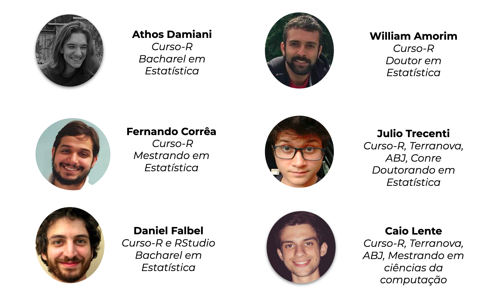
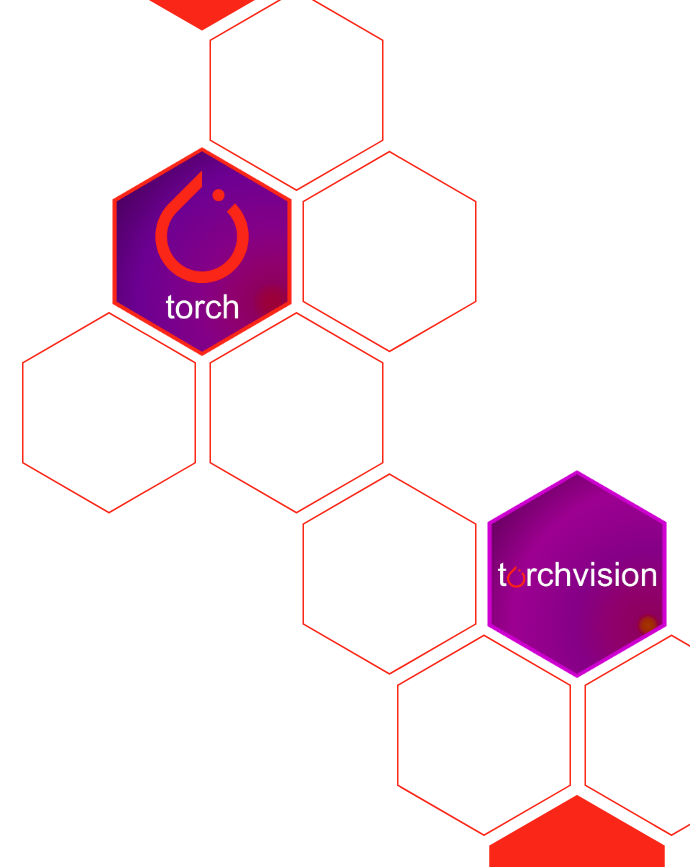

```{r setup, include=FALSE}
library(ggplot2)
library(magrittr)
library(knitr)
library(tidymodels)
library(tidyverse)
library(kableExtra)
theme_set(theme_minimal(14))
options(htmltools.dir.version = FALSE, fig.retina = 2)
```


# Curso-R

</img>

---

## Torch

.pull-left[

```{r}
library(torch)

torch_rand(3,4)
```

- Álgebra Linear/Matrizes
- Otimização
- Deep Learning

]

.pull-right[

## Criador

</img>

Daniel Falbel

]

---

## Torch - Ecossistema

.pull-left[

- [{torch}](https://torch.mlverse.org/) - Principal
- [{torchvision}](https://torchvision.mlverse.org/) - Funções e datasets para imagens
- [{torchdatasets}](https://mlverse.github.io/torchdatasets/) - datasets prontos para torch
- [{tabnet}](https://mlverse.github.io/tabnet/) - Funções para dados tabulares + backend para tidymodels
- [{torchaudio}](https://curso-r.github.io/torchaudio/) - Funões e datasets para áudios

]

.pull-right[

</img>


]

---

## Torch - Coisas boas  

- Autograd! (vou explicar =P)
- Pronto pra GPU
- Rápido/Eficiente (C++)
- Mais fácil de debugar, experimentar, brincar
- Modular, flexível, legal para criar coisas novas/pesquisa
- Comunidade grande e crescendo

## Links úteis

- [RStudio AI Blog](https://blogs.rstudio.com/ai/)
- [Códigos dessa Live](https://github.com/athospd/estatidados)


