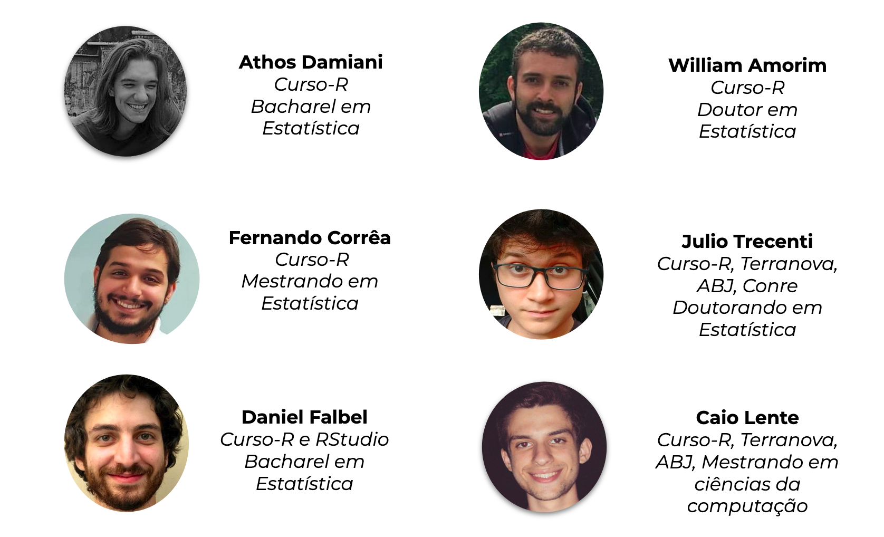
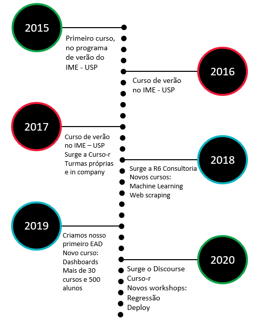

```{r setup, include=FALSE}
library(ggplot2)
library(magrittr)
library(knitr)
library(tidymodels)
library(tidyverse)
library(kableExtra)
theme_set(theme_minimal(14))
options(htmltools.dir.version = FALSE, fig.retina = 2)
```


# Curso-R

</img>

---

## Linha do tempo

<center>
</img>
</center>

---

## Torch

.pull-left[

```{r}
library(torch)

torch_rand(3,4)
```


]

.pull-right[

## Criador

(foto do dan)

]

---

## Torch - Ecossistema

- [{torch}](https://torch.mlverse.org/) - Principal
- [{torchvision}]() - Funções e datasets para imagens
- [{torchdatasets}]() - datasets prontos para torch
- [{torchaudio}]() - Funões e datasets para áudios
- [{tabnet}]() - Funções para dados tabulares + backend para tidymodels
